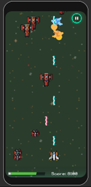
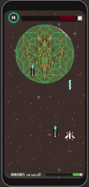
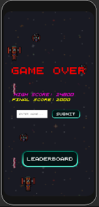
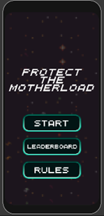
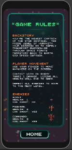
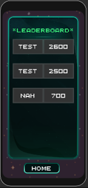

# Protect-The-Motherload

## Overview
Protect the Motherload is ashoot'em up game set in the year 2100 where players control the Star Sentinel battleship to defend against space pirates attempting to steal the valuable resource onboard. The game features intense space battles, challenging enemies, and an epic final boss battle.

## Video Demo
Click the image below to check out a video demo of the game!

## Gameplay

### Objective
Defend the Star Sentinel battleship by shooting down waves of enemy spaceships.

### Health
The Star Sentinel has 25 health points, and the game ends when all health is depleted.

### Scoring
* Scout: 100 points
* Fighter: 300 points
* Commando: 500 points
* Dreadnought (Boss): 3000 points
* Wave Clear Bonus: 1000 points

### Level Progression
* 5 levels with increasing difficulty.
* Each level has 2 waves, and the final level features a challenging boss battle against the Dreadnought.
* Enemies spawn in waves, and defeating them progresses to the next wave.

### Powerups
There are 4 drops added to the game which have a chance to spawn when an enemy is killed. The probability of a powerup dropping is based on the type of enemy killed.
* Shield: 5 seconds of invulnerability
* Overdrive: 5 seconds of increased ship speed
* Frenzy: 5 seconds of firing two lasers at once
* Health Recovery: Restores 1 health point

## Characters
### Player
The Star Sentinel is controlled using a virtual joystick on the mobile device's screen. The ship shoots automatically at a consistent rate and can destroy incoming enemy lasers. 
* Health: 25
* Weapon: Photon Laser

### Enemies
Enemies spawn at the top of the screen and move down. Once it reaches the bottom of the screen, it will randomly respawn at a different position at the top of the screen. The different enemy types vary based on health, speed, ability to shot, and movement patterns. 
#### Scout
* Health: 1
* Fast and small, challenging to hit.
#### Fighter
* Health: 3
* Upgraded hull and built-in laser.
#### Commando
* Health: 5
* Strongest armor and advanced technology.
#### Dreadnought (Boss)
* Health: 100
* Invulnerable shield and unique battle phases.

## Screenshots from Game

|           |             |             |
|----------------------------------------------|----------------------------------------------|--------------------------------------------------|
| *Game Screen*                                | *Boss Battle*                                | *Game Complete*                                  |

|  |        |  |
|----------------------------------------------|----------------------------------------------|------------------------------------------------------|
| *Starting Screen*                            | *Rules Screen*                              | *Leaderboard Screen*                               |

